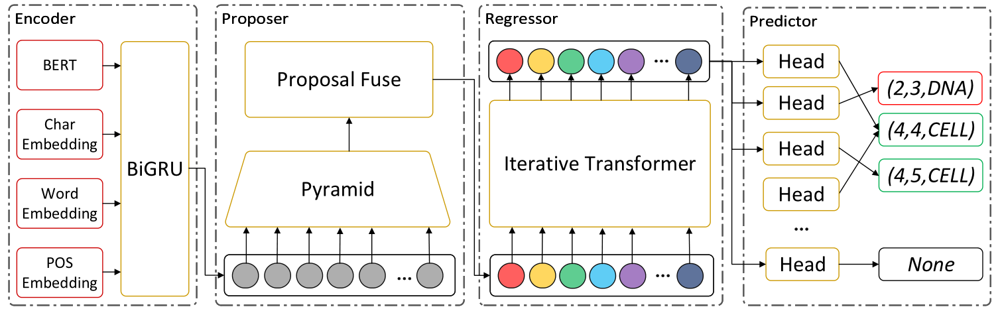

# README

Code for "**End-to-End Entity Detection with Proposer and Regressor**". Details and paper please check [here](https://link.springer.com/article/10.1007/s11063-023-11201-8).



## Setup

### Requirements

You can try to create environment as follows:

```bash
conda create --name EntityDetection python=3.9.13
conda activate EntityDetection
pip install -r requirements.txt
```

or directly import conda environment on Windows as follows:

```bash
conda env create -f windows.yaml
```

or directly import conda environment on Linux as follows:

```bash
conda env create -f linux.yaml
```

### Datasets

Original source of datasets:

+ GENIA: http://www.geniaproject.org/genia-corpus
+ CoNLL03: https://data.deepai.org/conll2003.zip
+ WeiboNER: https://github.com/OYE93/Chinese-NLP-Corpus/tree/master/NER/Weibo

You can download our processed datasets from [here](https://drive.google.com/drive/folders/19NUA5bvRe9zUOqtAfDfb3FGkn59GRYyg?usp=sharing).

Data format:

```json
{
  "tokens": [
    "IL-2",
    "gene",
    "expression",
    "and",
    "NF-kappa",
    "B",
    "activation",
    "through",
    "CD28",
    "requires",
    "reactive",
    "oxygen",
    "production",
    "by",
    "5-lipoxygenase",
    "."
  ],
  "entities": [
    {
      "start": 14,
      "end": 15,
      "type": "protein"
    },
    {
      "start": 4,
      "end": 6,
      "type": "protein"
    },
    {
      "start": 0,
      "end": 2,
      "type": "DNA"
    },
    {
      "start": 8,
      "end": 9,
      "type": "protein"
    }
  ],
  "relations": {},
  "org_id": "ge/train/0001",
  "pos": [
    "PROPN",
    "NOUN",
    "NOUN",
    "CCONJ",
    "PROPN",
    "PROPN",
    "NOUN",
    "ADP",
    "PROPN",
    "VERB",
    "ADJ",
    "NOUN",
    "NOUN",
    "ADP",
    "NUM",
    "."
  ],
  "ltokens": [],
  "rtokens": []
}
```

The `ltokens` contains the tokens from the previous sentence. And The `rtokens` contains the tokens from the next sentence.

## Word vectors

For used word vectors including Chinese word2vec, Glove and Bio-word2vec, you can download from [here](https://drive.google.com/drive/folders/1oJR7oZ1jcpuEpMXUg2wYBn4nzbTrNGEY?usp=sharing).

## Run

You can run the experiment on GENIA dataset as follows:

```bash
python main.py --dataset_name=genia --evaluate=test --concat --pretrain_select=dmis-lab/biobert-base-cased-v1.2 --word2vec_select=bio --batch_size=4 --epochs=5 --max_length=128 --pos_dim=50 --char_dim=50
```

You can run the experiment on weiboNER dataset as follows:

```bash
python main.py --dataset_name=weiboNER --evaluate=dev --evaluate=test --pretrain_select=bert-base-chinese --word2vec_select=chinese --batch_size=4 --epochs=5 --max_length=64
```

You can run the experiment on Conll2003 dataset as follows:

```bash
python main.py --dataset_name=conll2003 --evaluate=test --concat --pretrain_select=bert-base-cased --word2vec_select=glove --batch_size=4 --epochs=5 --max_length=128 --pos_dim=50 --char_dim=50
```

## Reference

If you have any questions related to the code or the paper or the copyright, please email `wenxr2119@mails.jlu.edu.cn`. 
We would appreciate it if you cite our paper as following:
```
@Article{Wen2023,
author={Wen, Xueru
and Zhou, Changjiang
and Tang, Haotian
and Liang, Luguang
and Qi, Hong
and Jiang, Yu},
title={End-to-End Entity Detection with Proposer and Regressor},
journal={Neural Processing Letters},
year={2023},
month={Apr},
day={13},
abstract={Named entity recognition is a traditional task in natural language processing. In particular, nested entity recognition receives extensive attention for the widespread existence of the nesting scenario. The latest research migrates the well-established paradigm of set prediction in object detection to cope with entity nesting. However, the manual creation of query vectors, which fail to adapt to the rich semantic information in the context, limits these approaches. An end-to-end entity detection approach with proposer and regressor is presented in this paper to tackle the issues. First, the proposer utilizes the feature pyramid network to generate high-quality entity proposals. Then, the regressor refines the proposals for generating the final prediction. The model adopts encoder-only architecture and thus obtains the advantages of the richness of query semantics, high precision of entity localization, and easiness of model training. Moreover, we introduce the novel spatially modulated attention and progressive refinement for further improvement. Extensive experiments demonstrate that our model achieves advanced performance in flat and nested NER, achieving a new state-of-the-art F1 score of 80.74 on the GENIA dataset and 72.38 on the WeiboNER dataset.},
issn={1573-773X},
doi={10.1007/s11063-023-11201-8},
url={https://doi.org/10.1007/s11063-023-11201-8}
}
```
